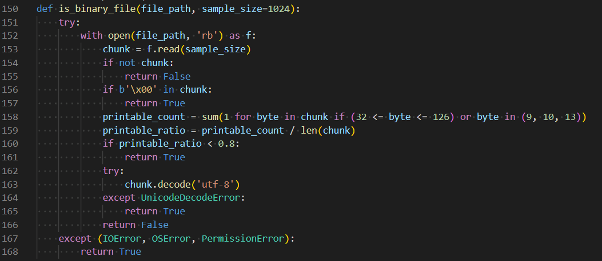
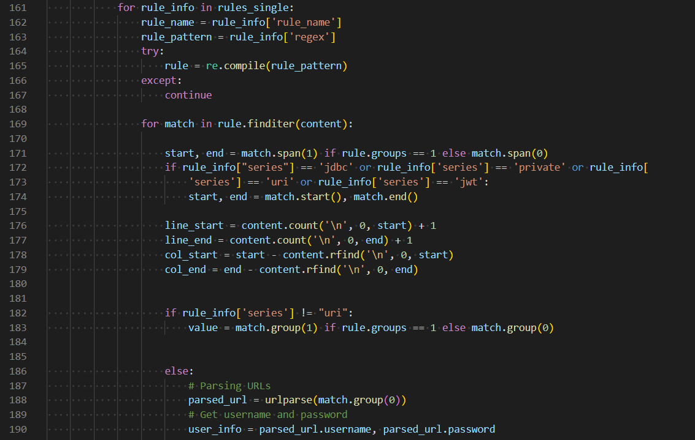
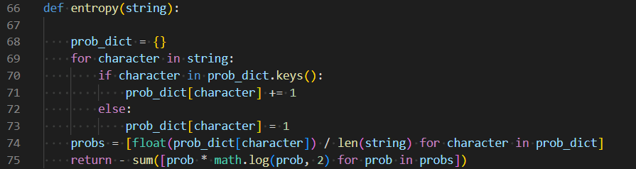
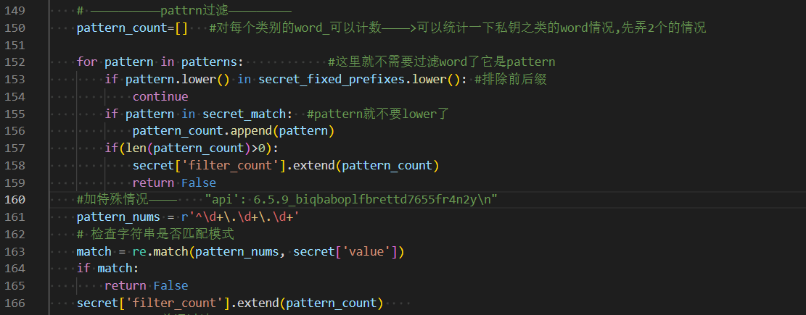
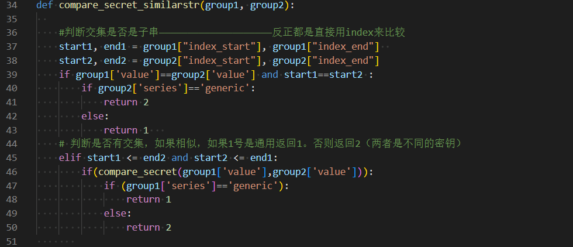
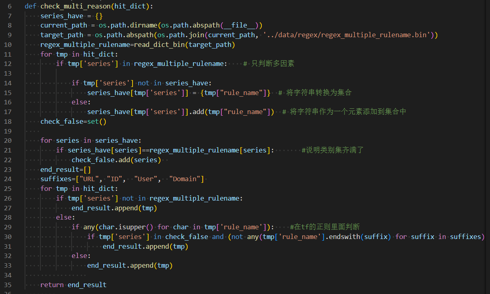
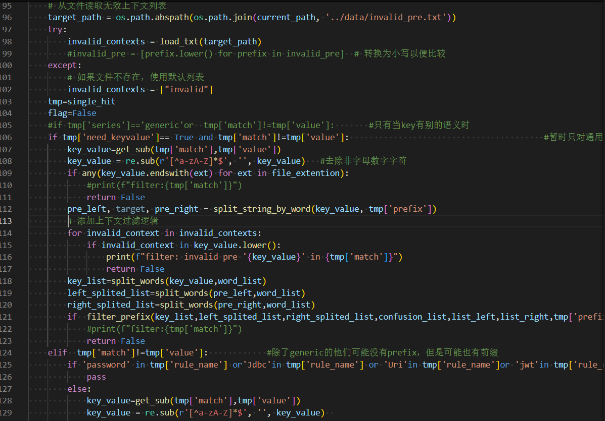
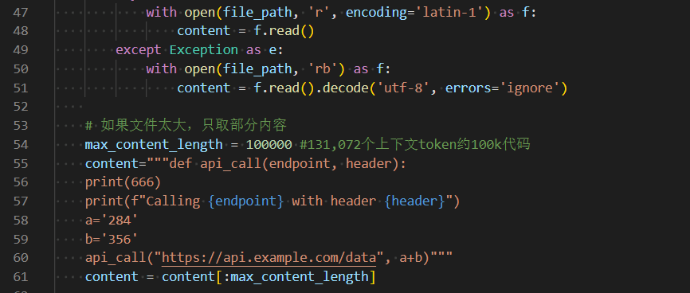
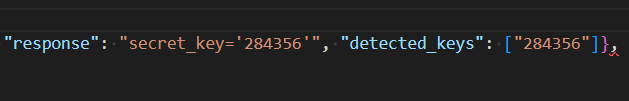

# datacon2025软件供应链安全赛道

武汉大学 哈基龙战队

> 参考KEYSENTINEL完成的一款通用的密钥检测工具。

> 注：我们基于本地的Qwen2.5-Coder-7B-Instruct-AWQ和零样本学习尝试实现LLM对密钥的检测（想依靠LLM的理解能力识别构造密钥），然后过滤并与检测结果合并实现了更高的成绩，代码（可直接运行）也放在了该目录下(llmdetect.py)。

## 运行命令

程序运行方法(input_path为检测的文件根目录，result_file_path为答案answer.json的目录)

> 注：正式比赛测试数据dataconfiles.tar.gz中的文件已经解压至all_files_hash。
> 控制台输出的是进度，检测情况日志实时输出在./states/result_x/log.json中(x代表最大编号)。

```sh
# datacon2025目录下
python main.py --input_path <test_path> --output_path <result_file_path>
```

加上计时和保存命令行输出的命令行

```sh
# datacon2025目录下
(time python main.py --input_path <test_path> --output_path <result_file_path>) 2>&1 | tee runtime.log
```

命令示例：计时检测示例文件并将answer.json保存在result文件夹下

```sh
# datacon2025目录下
(time python main.py --input_path ./exsample_files --output_path ./result) 2>&1 | tee 
```

## 依赖环境与安装说明

### 1. 环境要求

- Linux（Windows需修改代码处理 module 'signal' has no attribute 'sigalrm' 错误。这是因为 Windows 不支持 Unix 信号，如 SIGALRM）
- Python 3.8+
- Node.js v16.17.1

### 2. 安装依赖

```sh
pip install -r requirements.txt
```

## 代码结构说明

### 主要目录结构
```plaintext
datacon2025/
├── README.md                  # 项目说明文档
├── Dockerfile                 # Docker容器配置
├── main.py                    # 主程序入口
├── hit_git_tf.py              # 命中检测程序
├── answer/                    # 输出结果目录
│   └── answer.json            # 答案输出文件
├── exsample_files/            # 示例文件目录（包含10个示例文件）
├── base_func/                 # 基础功能模块
├── filter/                    # 过滤功能模块
├── get_strings/               # 字符串提取模块
├── data/                      # 数据资源目录
└── asserts/                   # 用于保存README.md中的截图
└── keyleaktex                 # write up
```

#### base_func/ - 基础功能模块
- `getanswer.py` - 保存输出答案
- `save_state.py` - 状态保存功能
- `analyse_result.py` - 结果分析功能
- `base_func.py` - 基础工具函数
- `logger.py` - 日志记录功能

#### filter/ - 过滤模块
- `filter_multireason.py` - 多原因过滤
- `filter_pattern_word.py` - 模式词过滤
- `filter_similarstr.py` - 相似字符串过滤
- `filter_substr.py` - 子字符串过滤
- `key_value_Filter.py` - 键值对过滤

#### get_strings/ - 字符串提取模块
- `base_func.py` - 基础提取功能
- `filter_strings.py` - 字符串过滤
- `general_get.py` - 通用提取
-`py_get.py` - Python文件提取
-`js_get.py` - JavaScript文件提取
-`java_get.py` - Java文件提取
-`go_get.py` - Go文件提取
-`json_get.py` - JSON文件提取
-`csv_get.py` - CSV文件提取
-`ipynb_get.py` - Jupyter笔记本提取
-`xml_get.py` - XML文件提取
-`plist_get.py` - Plist文件提取
-`yaml_get.py` - YAML文件提取
- `go/` - Go语言相关工具
- `node_modules/` - Node.js依赖包

#### data/ - 数据资源目录
- `patterns.txt` - 模式定义文件
- `file_extension.txt` - 文件扩展名定义
- `target_words.csv/xlsx` - 目标词汇表
- `regex/` - 正则表达式规则
- 各种过滤词等数据文件

## 主要算法思路与相应代码位置的截图
1. 文件筛选

    - 跳过二进制文件:./base_func/base_func.py

    

2. 数据提取

    - 数据截图在get_strings模块中，截图略。多语言字符串提取：通过get_strings/模块从不同类型的代码文件（Python、JavaScript、Java、Go等）中提取字符串，针对JSON、CSV、YAML等结构化数据文件进行专门的解析处理。

    - 命中检测(hit_git_tf.py)(会调用filter进行过滤)

    

3. 数据过滤

    - 熵值检测 (base_func.py)
    

    - 模式词过滤(key_value_Filter.py)
    

    - 相似字符串过滤(filter_similarstr.py)
    

    - 子字符串过滤(filter_substr.py)
    

    - 多原因过滤(filter_multireason.py)
    

    - 上下文过滤+键值对过滤(key_value_Filter.py)
    

## 附录：基于本地的Qwen2.5-Coder-7B-Instruct-AWQ和零样本学习实现的LLM对密钥的检测

以下一一个例子说明LLM对构造密钥的检测的有效性：将文件列表取成长度为1的列表，然后content替换成测试内容。



成功检测出结果，显然是正则表达式做不到的：


